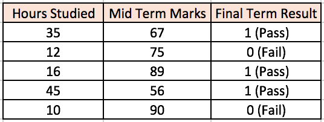
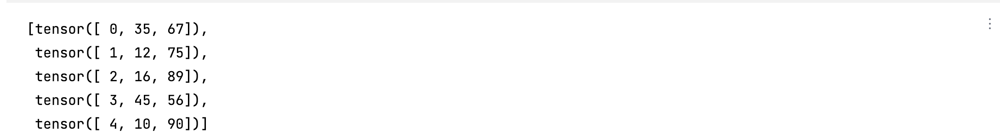

我们实现在这里实现知乎专栏[神经网络快速入门：什么是多层感知器和反向传播？](https://zhuanlan.zhihu.com/p/23937778)实现考生成绩的分类器。首先，我们的原始数据如图片所示：



首先，我们使用pandas和pytorch将数据转化为运算中需要使用的tensor。

```python
import pandas as pd
import torch

data = {'Hours Studied': [35,12,16,45,10], 'Mid Term Marks': [67,75,89,56,90],}
label = [1,0,1,1,0]
dataFrame = pd.DataFrame(data=data)
train_data = []

for row in dataFrame.itertuples():
    train_data.append(torch.tensor(row))
```

得到的train_data如下：



这就是训练需要的所有数据。label单独作为一个列表。