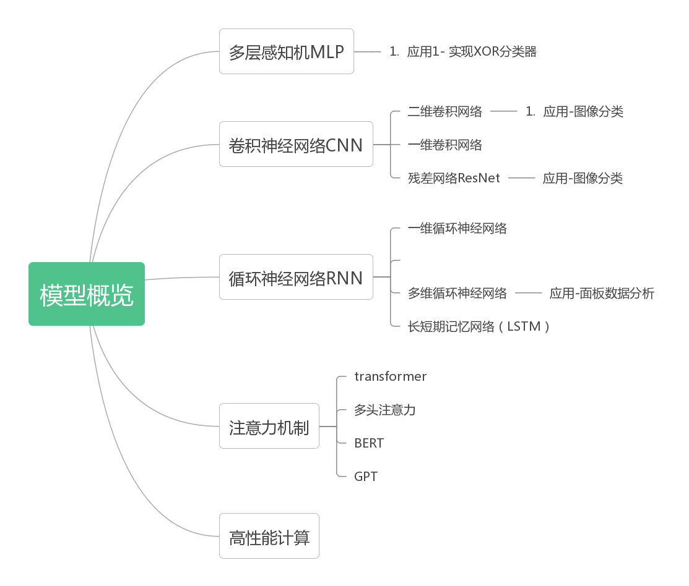

# DeepLearningRoadMap

[TOC]

## 前言—项目的组织方式：将文档、文献、代码、项目管理结合在一起

在深度学习相关的研究中我们会遇到以下场景：

1. 学习内容广泛，模型之间联系松散，需要有思维导图将知识点关联起来，用于形成知识体系。

2. 为了说明一个模型的理论，会大量用到数学公式、图片、代码，需要一套可以对多种文档要素混合排版的的工具。

3. 一个模型往往涉及到很多参考文献，需要有标准的引用格式，灵活的跳转功能。

4. 为了实现一个模型，需要编写能运行的代码，考虑到：

   1. 需要一个类似Jupyter Notebook形式的文档，markdown用来解释理论，代码用来执行；
   2. 但notebook本身与git的兼容性差，不适合直接对它进行版本管理。

   为此我们需要一套特殊的markdown- notebook二元转换机制。

5. jupyter notebook的代码是研究使用，真正用来上线运行的是把理论解释部分删除、类和结构更为复杂的精炼版代码，为此需要一套notebook-py的二元转换机制。

6. 为了追踪项目编辑过程中的错误、管理项目中用到的所有图片与附件资源、记录每一次更新内容，需要把整个项目放在git下进行管理。

下面分别看如何实现这几个目标：

1. 思维导图

   使用金山文档的思维导图/流程图功能，将编辑好的思维导图的路径和截图同时放在这里，如下所示：[【金山文档】 思维导图-外链测试](https://kdocs.cn/l/caW1YRMcLFpm)

   

   

   2. 使用markdown+Typora

   3. 参考文件使用markdown+Typora的脚注功能。参考文献引用及一个本地下载的例子见此[^1]。

   4. 我们约定一个工作流，如下图所示：

   5. 我们将代码分为explore和formal两部分，前者以jupyter notebook为主，后者以纯Python代码为主。

   6. 我们用git管理所有文件，使用pycharm自带的版本管理工具。

      

      [^1]: 梁宏涛,刘硕,杜军威等.深度学习应用于时序预测研究综述[J].计算机科学与探索,2023,17(06):1285-1300. [下载地址](https://pan.baidu.com/s/1Vqf1g3X7JbHnhqplPflkZQ?pwd=ab12)

## Part 1—模型概览

[【金山文档】 模型概览](https://kdocs.cn/l/ciS6SawMJ0YU)

备用导图1 备用导图2 备用导图3

## Part 2—基础部分学习路径

### 1. 代码运行环境配置

### 2.理论学习

#### 2.1 多层感知机

理论部分，参考知乎专栏[神经网络快速入门：什么是多层感知器和反向传播？](https://zhuanlan.zhihu.com/p/23937778)。文中提到的数据，

## Part 3—原始模型、论文分析与代码实现

Part 3—原始模型、论文分析与代码实现

## Part 4—原始模型到时间序列的迁移学习

Part 3—原始模型、论文分析与代码实现

## Part 5—自主研究模型

