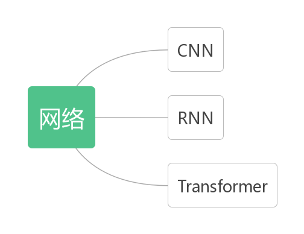

# DeepLearningRoadMap

## 前言—项目的组织方式：将文档、文献、代码、项目管理结合在一起

在深度学习相关的研究中我们主要会遇到以下场景：

1. 学习内容广泛，需要有思维导图将知识点关联起来，便于查询。
2. 为了说明一个模型的理论，会大量用到数学公式、图片、甚至动图。需要一套功能强大、排版简单的工具。
3. 一个模型往往涉及到很多参考文献，需要有标准的引用格式，灵活的跳转功能，文件可以直接本地下载。
4. 为了实现一个模型，需要编写能跑的代码，考虑三点情况：第一，代码需要用markdown辅助解释；第二，markdown中的代码不能脱离版本管理，失去维护；第三，避免直接对jupyter notebook进行版本管理（git与notebook的兼容性差)。为此我们需要一套特殊的markdown- notebook二元转换机制。
5. jupyter notebook的代码是研究使用，真正用来上线运行的是把理论解释部分删除、类和结构更为复杂的精炼版代码，为此需要一套notebook-py的二元转换机制。
6. 为了追踪项目编辑过程中的错误、管理项目中用到的所有图片与附件资源、记录每一次更新内容，需要把整个项目放在git下进行管理。

下面分别看如何实现这几个目标：

1. 思维导图

   使用金山文档的思维导图功能，将编辑好的思维导图的路径和截图同时放在这里，如下所示：

   [【金山文档】 未命名文件](https://kdocs.cn/l/caW1YRMcLFpm)

   

   

   2. 使用markdown+Typora

   3. 参考文件使用markdown+Typora的脚注功能。参考文献引用及一个本地下载的例子见此[^1]。

      [^1]: 梁宏涛,刘硕,杜军威等.深度学习应用于时序预测研究综述[J].计算机科学与探索,2023,17(06):1285-1300. [下载地址](./papers/深度学习应用于时序预测研究综述_梁宏涛.pdf)

